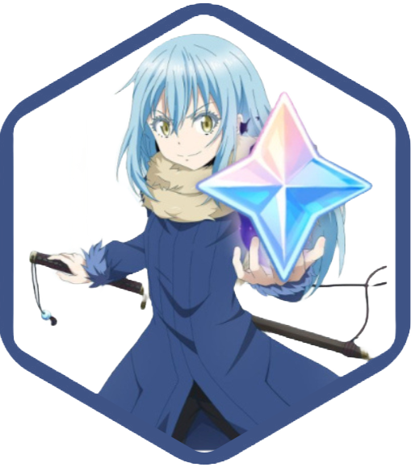
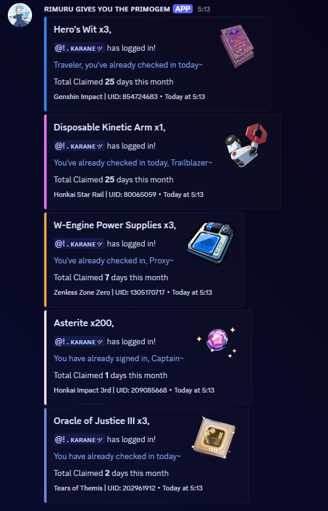
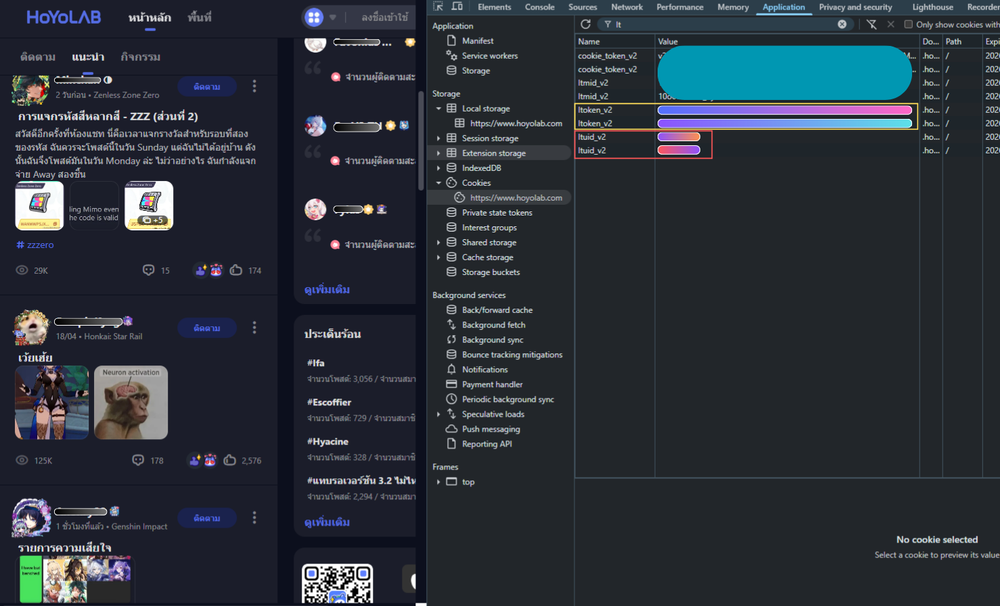
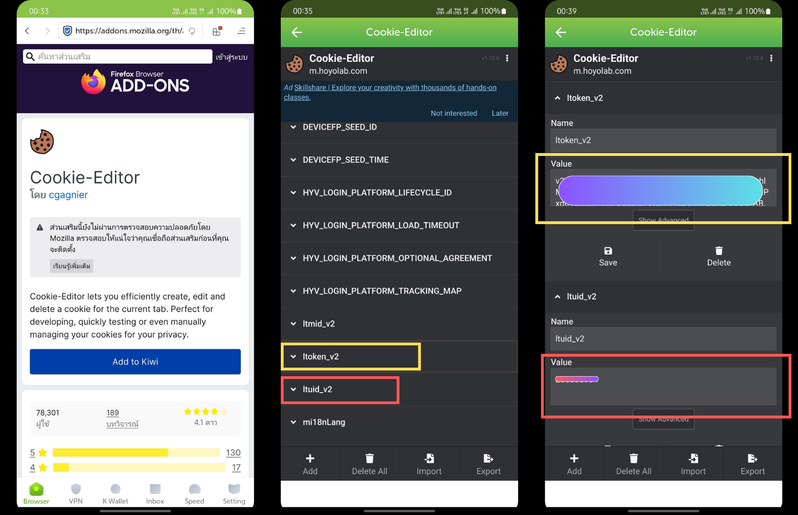

<h1 align="center">
    <br>
    Rimuru-gives-you-the-primogems
</h1>


<div align="center">

[](https://opensource.org/licenses/MIT)
[](https://github.com/Nattapat2871/Rimuru-gives-you-the-primogems/stargazers)


</div>

<p align= "center">
        <b>English</b>　<a href="/README_TH.md">ภาษาไทย</a>


### or ***HoYoLab Auto Login***
This `Javascript` is an automatic script for Google Apps Script. It handles your daily HoYoLab check-ins automatically and sends you status updates through a Discord Webhook. It's free, easy to use, and super safe.
<p align="center"></p>

 ### result : I didn't log into the game at all, lol. 

<p align="center"></p>

 ## Features
 * **Cool Notification Window** - The Discord notification embeds for check-ins look great.
 * **Safe** - You can use and adapt this script yourself without worrying about your data leaking.
 *  **Free** - You can use this script for free on [Google App Script](https://script.google.com/home/start) or use the [Javascript](main.js) version. 
 *  **Easy to Use** - The script works without needing to open any websites, and it automatically notifies you via Discord Webhooks.
 *  **Easy Setup** - There's a specific section in the script you can customize, like which games to check in, UIDs, language, Discord notifications, or even customizing the webhook name and avatar.
 *  **Check-ins** - Although it supports Multiple account, And if all your games use the same HoYoLab account, it can check in for all of them: `Genshin Impact, Honkai Star Rail, Zenless Zone Zero, Honkai Impact 3, Tears of Themis.` It works for all servers too: `Asia, Europe, America, TW HK MO server.`

        
## Setup
1. Copy the script code for [rimuru-gives-you-primogems.gs](gs/Rimuru-gives-you-the-primogems.js)  which is used on Google App Script.
2. Go to [Google App Script](https://script.google.com/home/start) and create a new project. Name it whatever you like. (Note: The link in the original text pointed to GitHub, but the context implies Google App Script).
3. Edit the section labeled `Configuration Section` his includes your Token, game settings, UIDs, and Discord notification settings. , **See the Configuration guide below for help.**
4. Select `main` function from the dropdown menu at the top and click `run`. You'll need to grant the necessary permissions.
5. Set up a `Trigger` so the script runs automatically at a set time. Go to `Trigger` (the clock icon on the left sidebar), click `Add Trigger` and set it up like this: Choose function to run: `main` Choose deployment: `Head` Select event source `Time-driven` Select type of time based trigger: `Day timer` Select time of day `2am - 3am" (or whenever you prefer)` Set error notification settings: `Notify me daily`  Then click **`Save`**

## Configuration
```Javascript 
const profiles = [
    
    {  // --- Configuration Section ---


        // Main Account 

         accountName: "Main", // <--- Enter AccountName 
         myDiscordID: "", // <--- Enter ID Discord of account owner.

         token: "ltoken_v2=xxxxxx; ltuid_v2=xxxxxx;", // <--- PUT YOUR TOKEN

        // --- Setting the game to enable (true = enable, false = disable) ---
        genshin: true,
        honkai_star_rail: true,
        zzz: true,
        honkai_3: true,
        tears_of_themis: true,

        // --- Enter your UID ---
        customUids: {
            Genshin: "",
            Star_Rail: "",
            ZZZ: "",
            Honkai_3: "",
            Tears_of_Themis: ""
        },


        // --- Support 15 languages ---
        // English: en-us
        // 简体中文 (Simplified Chinese): zh-cn
        // 繁體中文 (Traditional Chinese): zh-tw
        // 日本語 (Japanese): ja-jp
        // 한국어 (Korean): ko-kr
        // Bahasa Indonesia (Indonesian): id-id
        // Deutsch (German): de-de
        // Español (Spanish): es-es
        // Français (French): fr-fr
        // Italiano (Italian): it-it
        // Português (Portuguese): pt-pt
        // Русский язык (Russian language): ru-ru
        // ภาษาไทย (Thai language): th-th
        // Türkçe (Turkish): tr-tr
        // Tiếng Việt (Vietnamese): vi-vn

        lang: 'en-us' // <--- Enter the desired language.
    },

    {    
        // Account 2 : If you want to log in to Multiple_accounts

        accountName: "", // <--- Enter AccountName 
        myDiscordID: "", // <--- Enter ID Discord of account owner.

        token: "ltoken_v2=xxxxxx; ltuid_v2=xxxxxx;",  // <--- PUT YOUR TOKEN

        // --- Setting the game to enable (true = enable, false = disable) ---
        genshin: true,
        honkai_star_rail: true,
        zzz: true,
        honkai_3: true,
        tears_of_themis: true,

        // --- Enter Your UID ---
        customUids: {
            Genshin: "",
            Star_Rail: "",
            ZZZ: "",
            Honkai_3: "",
            Tears_of_Themis: ""
        },

        lang: 'en-us' // <--- Enter the desired language.
    },
    
    /* 
    {    
        // Account 3 , 4 , 5 :    If you have multiple accounts, you can copy the format from above and add them yourself.

        accountName: "", // <--- Enter AccountName 
        myDiscordID: "", // <--- Enter ID Discord of account owner.      etc. */ 
];


/** Multiple account login **/
const Multiple_accounts = false; // <---  true = (on) multiple account login, false = (off) Main account login only

/** Discord Notification **/
const discord_notify = true; // Set to true to enable Discord notifications.
const discordWebhooks = [
    "https://canary.discord.com/api/webhooks/", // <--- Enter Main Webhook URL 

    /* You can add a URL to send notifications to any message box. */
 // "https://canary.discord.com/api/webhooks/",  // <--- Enter Webhook URL 2
 // "https://canary.discord.com/api/webhooks/",  // <--- Enter Webhook URL 3

];
const webhooks_username = "ʀɪᴍᴜʀᴜ ɢɪᴠᴇꜱ ʏᴏᴜ ᴛʜᴇ ᴘʀɪᴍᴏɢᴇᴍ"  // <--- Enter Username Webhooks
const webhooks_avatar_url = "https://cdn.discordapp.com/attachments/1276433865375879199/1277718573439127572/image.png?ex=66ce2fa6&is=66ccde26&hm=0e32ea05e2b673c64ae1bfc310bd5e045875a6d5798c768c18f877929922540a&"  // <--- Enter Avatar URL link

/** Notification message in Embeds*/
const logedin_text = "has logged in!"
const totalclaim_text_1 = "Total Claimed"
const totalclaim_text_2 = "days this month"


//     ---- This is all that needs to be fixed. ----
```
### Explaining this `config` 
* **`accountName`** Name the account. Basically, you should name it as: `Main`
*  **`mydiscordID`** Put your Discord User ID here. This helps identify the HoYoLab account owner and allows the bot to ping you in notifications.
*  **`token`** You need to paste your HoYoLab token here so the script can log in for you.   **```token: "ltoken_v2=xxPasteValueHerexx; ltuid_v2=xxPasteValueHerexx;",```** [See more info here](https://github.com/Nattapat2871/Rimuru-gives-you-the-primogems/blob/main/README_TH.md#token-hoyolab)
*  **`Choose which games to auto check-in`** Set which games you want to automatically check in. You can turn only some on. For example, if you only want Genshin, change it to  **```genshin: true, honkai_star_rail: false, zzz: false, honkai_3: false, Tears of Themis: false,```**
*  **`CustomUid`** Enter your game UID for each game here. It's optional.
*  **`lang`**  This sets the language for responses. For Japanese, change it to  ``` lang: 'ja-jp'```
*  **`Multiple_accounts`** Enable multiple accounts if you need `true ` You need setup multiple accounts as `Account 2`  If you don't use it, you can just turn it off. `false`
*  **`discord_notify`**  `turns on` Discord webhook notifications. If `false`, the results will just show up in the `Consolelog` instead.
*  **`discordWebhook`** The script needs this URL to send notifications. Go to a Discord server you own or manage: **`Create a new channel > Edit Channel > Integrations > Webhooks > Create Webhook > Copy Webhook URL`** and paste it here.
*  **`webhooks_username`** และ **`webhooks_avatar_url`**  เSet the name and profile picture the webhook will use when sending notifications.
  
#### That's all you need to edit yourself. Don't mess with the rest of the script code below that, as it's needed for the script to run correctly. 


## Token HoYoLab  

  It's a unique piece of data used to **verify your identity (Authentication)** when you want to access HoYoLab info or services using a program or script, instead of just Browse the website normally. Usually, these `Token`  are stored in your web browser's `Cookies` after you log into the HoYoLab website. [HoYoLab](hoyolab.com) You can find yourา `ltuid` and `ltoken` values using:

<details>
<summary><b> Chome Desktop Browser ( Finding the values on Desktop )  </b></summary>
<br>

1. **Go to Web** - You can grab the token from your browser by going to the [official HoYoLab website.](https://www.hoyolab.com)

2. **Login** - Log into the website properly.

3. **Developer tools** - Open Developer Tools. Go to the `3-dot icon` in the top-right corner of browser's app. > `More tools` > `Developer tools` or just press `F12`

4. **Cookies** -  Go to the `Application` tab, then look under `storage` > `cookies` > `https://hoyolab.com/home`  Type `lt` into the `filter` box.

5. **Token** -  You should see`ltoken_v2` ( yellow box in image ) and `ltuid_2 ` ( red box in image ) under the `NAME` column, like in the picture below.

6. **Config** - Copy the `Value` for `ltoken_v2` (any one line) and `ltuid_v2` (any one line) and paste them into the [Config](https://github.com/Nattapat2871/HoyoverseGames-auto-login/blob/main/README_TH.md#configuration) section like this: `token: "ltoken_v2=xxxxxx; ltuid_v2=xxxxxx;", `
   
 <p align="center"></p>
</details>

<details>
<summary><b>Mobile Kiwi Browser Extension ( Finding the values on Mobile ) </b></summary>
<br>
    
> **iOS** - There's currently no way to view the `token` on mobile because iOS has limitations and doesn't support apps with `developer tools`

### Andriod : 
#### Since `Chome Moblie` doesn't have  `Developer tools` , you need to use **`Kiwi browser`** and the `Cookie Editor` Extension instead ** <br>

* **Kiwi browser** -  It's a web browser for Android based on Chromium (same as Google Chrome). Its main feature is that it `supports most Extensions` from the [Chrome Web Store](https://chromewebstore.google.com/category/extensions) directly on your Android phone.
  
1. **Install Kiwi browser** - You can install  **Kiwi browser**   from the [play Store](https://play.google.com/store/apps/details?id=secure.unblock.unlimited.proxy.snap.hotspot.shield&pcampaignid=web_share)

2. **Extension** - Once downloaded, open the app and go to `More (3 dots)` in the top-right corner  > `Extension` Search for and install the [Cookie-Editor](https://addons.mozilla.org/th/firefox/addon/cookie-editor/) extension And Click `Add to kiwi` > `install`

3. **Go To Web** - After installing the extension, go to the [official HoYoLab website](https://www.hoyolab.com)  and log in completely.

4. **Token** - Click the `More (3 dots)` icon again, And go to `Extension` > `Cookie-Editor` You'll see all the `cookies` for the website. Scroll down to find `ltoken_v2` and `ltuid_v2`

5. **Config** - Copy the `Value` for `ltoken_v2` and `ltuid_v2` and paste them into the [Config](https://github.com/Nattapat2871/HoyoverseGames-auto-login/blob/main/README_TH.md#configuration)  section:  `token: "ltoken_v2=xxxxxx; ltuid_v2=xxxxxx;", `


 
<p align="center"></p>
</details>

> [!IMPORTANT]
>Your HoYoLAB Token is like a password for your HoYoverse account. If someone else gets this Token, they can access your HoYoLAB account without needing your password, check >your private info like check-in history, game profiles, or your activities on HoYoLAB, or maybe even worse. So, please keep your Token safe! Don't share it publicly with >others. If you think your Token is compromised, change your account password immediately by going to [HoYoLab Account](https://account.hoyolab.com)


## How it Works

This script uses your `Token HoYoLab` to automatically log into HoYoLab for the games you've selected `(like Genshin, Star Rail)`. It sends check-in requests (API Requests) to HoYoLab's servers, checks the results `(Success, Already checked in, or CAPTCHA hit)`, and then sends a summary of the check-in status and any rewards received to the Discord Webhook you set up.

## Source Code 
> I used `Gemini advence 2.5 Pro`  to help write a bit of this script.
* [main.js](https://github.com/Nattapat2871/Rimuru-gives-you-the-primogems/blob/main/main.js)  is a script meant to be run on your own machine `(e.g., run with vscode)`.  It can't be used directly in Google Apps Script, but the functions are the same. ( Before use, you must install `axios` Node_modules first.)
* [node_modules](node_modules) are modules only for `main.js`, not related to `Rimuru-gives-you-the-primogems.js`
* [gs](https://github.com/Nattapat2871/Rimuru-gives-you-the-primogems/tree/main/gs) The files inside this folder are actually `.gs` **These are the scripts for running on Google Apps Script.** They can't be run on your machine. There's an [English version](gs/Rimuru-gives-you-the-primogems.js) และ [Thai version](gs/Thai_Rimuru-gives-you-the-primogems.js)

## MIT License - Copyright and Licensing

`Copyright (c) 2025 Nattapat2871` <br>
**Total Freedom:** You can use, modify, share, or even sell this software for free. <br>
**One Condition:** You must always include the copyright notice and this License text with it. <br>
**No Guarantees:** The software comes "as is". The creator doesn't promise it will work perfectly. <br>
**Not Responsible::** If something goes wrong while using it, the creator isn't responsible for any damages.

**Basically:** "Do whatever you want with it for free, just keep my name and the license attached. If it breaks or causes problems, that's on you, not me."


## Changelogs

* `19:24 26/6/2025 : Added result image And Contact discord server`
* `23:30 25/4/2025 : Added function Multiple Accounts login And Notify Webhooks in more server`
* `10:55 25/4/2025 : Added MIT License`
* `02:18 25/4/2025 : Fixed Console log Debug slightly`
* `23:30 24/4/2025 : Added language selection feature`
* `22:46 24/4/2025 : Added check-in function for Tears of Themis`
* `16:25 24/4/2025 : First Commit`


        
### Channels to follow news or contact us [Discord Server](https://discord.gg/RbyUEseDYP)

