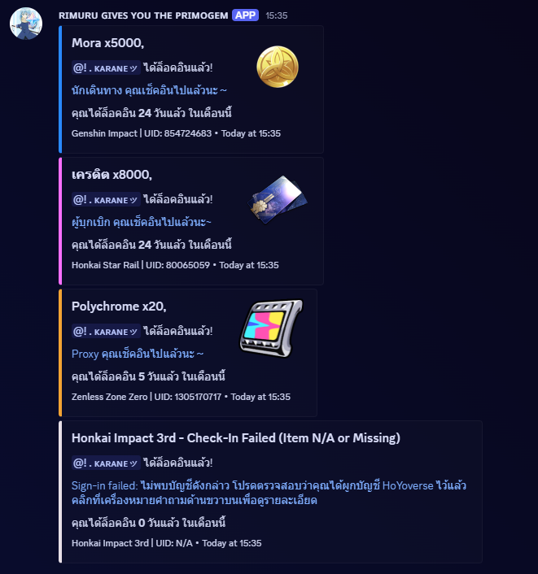

<h1 align="center">
    <br>
    Rimuru-gives-you-the-primogems
</h1>

<p align= "center">
        <a href="/README.md">English</a>   <b>Thai</b>　
    
### หรือ *Hoyolab auto login*
script นี้จะเช็คอินรางวัลใน HoyoLab ของเราโดยอัตโนมัติ ใช้งานง่าย และปลอดภัย โดยสามารถรองรับบัญชีเดียวแต่ล็อคอินได้ทุกเกม  ในตอนนี้จะรองรับ Genshin impact , Honkai Starrail , Zenless Zone Zero , Honkai Impact 3 และ Tears of Themis 
<p align="center"></p>

 ## คุณสมบัติ
 * **หน้าต่างการแจ้งเตือนสวย** - Embeds ที่แจ้งเตือนการล็อคอินใน Discord สวยงาม
 * **ปลอดภัย** - สามารถเอาสคริปต์ไปปรับใช้ในแบบของตัวเองได้ โดยไม่ต้องกลัวว่าข้อมูลจะรั่วไหล
 *  **ฟรี** - สามารถนำสคริปต์นี้ไปใช้งานฟรีได้ใน [Google App Script](https://script.google.com/home/start)  หรือจะใช้ในเวอร์ชั่นของ Javascript ก็ได้ 
 *  **ใช้ง่าย** - เพราะสคริปต์ใช้ได้โดยไม่ต้องเปิดเว็บอะไรเลย และจะแจ้งเตือนอัตโนมัติผ่าน Discord Webhooks
 *  **ตั้งค่าง่าย** - ในสคริปต์จะมีโซนที่สามารถปรับแต่งเองได้ เช่น ล็อคอินเกมอะไร , UID , การแจ้งเตือนผ่าน Discord หรือ ปรับแต่งชื่อและรูปอวาตาร์เอง
 *  **การล็อคอิน** - ถึงจะรองรับแค่ 1 บัญชี แต่ถ้าทุกเกม login ด้วยบัญชี Hoyolab อันเดียวกัน ก็สามารถล็อคอินได้ทุกเกมและทุกเซิฟเวอร์ แม้ว่าจะเล่นในเซิฟ **`Asia , Europe , America , TW HK WO server`** ก็ล็อคอินได้หมด

        
## การ Setup
1. คัดลอกสคริปต์ของ [rimuru-gives-you-primogems](https://github.com) ที่ใช้บน Google App Script
2. ไปที่ [Google App Script](https://github.com) และสรา้งโปรเจกต์ใหม่ ตั้งชื่อตามต้องการ
3. แก้ไขในส่วน `โซนที่ต้องปรับแต่ง` จะมี Token , การตั้งค่าเกม , Uid และ การแจ้งเตือน Discord , **ดูคำแนะนำในส่วนของ Configuration ด้านล่าง**
4. เลือก `runAutoCheckIn` และกด `run` ที่บรรทัดบนสุด ยืนยันสิทธิ์การเข้าถึงให้เรียบร้อย
5. กำหนด `ตัวทริกเกอร์` เพื่อให้สคริปต์ทำงานในเวลาที่ตั้งค่าไว้ โดยไปที่ `ทริกเกอร์` รูปนาฬิกาอยู้ซ้ายสุด และกด `เพิ่มทริกเกอร์` และปรับค่า เลือกฟังก์ชั่นเป็น `runAutoCheckin` เลือกปรับใช้การทำงานเป็น `Head` เลือกแหล่งที่มาของกิจกรรมรรมเป็น `ตามเวลา` เลือกประเภทเป็น `จับเวลาเป็นวัน` และเลือกเวลาของวันเป็น `02:00 - 03:00" (หรือแล้วแต่จะตั้ง)` เลือกตั้งค่าการแจ้งเตือนเมื่อล้มเหลวเป็น `ทุกวัน`  และกด **`บันทึก`**

## Configuration
```Javascript 
     const profiles = [
    {  // --- โซนที่ต้องปรับแต่ง ---

        // --- ใส่ TOKEN ของ hoyolab ---
        token: "ltoken_v2=xxxxxx; ltuid_v2=xxxxxx;", 

        // --- ตั้งค่าเกมที่จะเปิดใช้ออโต้ล็อคอิน ( true = เปิด , false = ปิด ) ---
        genshin: true,
        honkai_star_rail: true,
        zzz: true,
        honkai_3: true,

        // --- ใส่ UID ของเกมที่จะออโต้ล็อคอิน---
        customUids: {
            Genshin: "",
            Star_Rail: "",
            ZZZ: "",
            Honkai_3: ""
        }
    },
];

/** การแจ้งเตือนที่ Discord **/
const discord_notify = true; // ตั้งค่าให้เป็น true เพื่อรับการแจ้งเตือน
const myDiscordID = ""; // <---  ใส่ Discord ID ของตัวเอง
const discordWebhook = "https://canary.discord.com/api/webhooks/"; // <--- ใส่ Webhook URL
const webhooks_username = "ʀɪᴍᴜʀᴜ ɢɪᴠᴇꜱ ʏᴏᴜ ᴛʜᴇ ᴘʀɪᴍᴏɢᴇᴍ"  // <--- ใส่ชื่อของ Webhooks
const webhooks_avatar_url = "https://cdn.discordapp.com/attachments/1276433865375879199/1277718573439127572/image.png?ex=66ce2fa6&is=66ccde26&hm=0e32ea05e2b673c64ae1bfc310bd5e045875a6d5798c768c18f877929922540a&"  // <--- ใส่รูปภาพของ webhooks
```
### Token hoyolab - เอามาจากไหน?

<details>
<summary><b> Chome Desktop Version</b></summary>
<br>

1. **Go to Web** - นั้นเราสามารถดึงออกมาจากเบราเซอร์ได้โดยการเข้าไปที่ [เว็บทางการของ HoyoLab](https://www.hoyolab.com)

2. **Login** - จากนั้นทำการล็อคอินเว็บให้เรียบร้อย

3. **Developer tools** - เปิด Developer tools โดยไปที่ `รูปไอคอน 3` จุดของแอปเบราว์เซอร์มุมขวาบน > `More tools` > `Developer tools` หรือกด `F12` ก็ได้

4. **Cookies** - ไปที่หมวดของ `Application` และเลื่อนลงมาดูที่ `storage` > `cookies` > `https://hoyolab.com/home`  จากนั้นทำการค้นหา `lt` ที่ช่อง `filter`

5. **Token** - จากนั้นจะเห็น`ltoken_v2` ( กรอบสีเหลือง ) และ `ltuid_2 ` ( กรอบสีแดง ) ที่ช่องของ `NAME` เหมือนในภาพด้านล่าง

6. **Config** - ให้คัดลอก `ltoken_v2` และ `ltuid_v2` ที่แสดงในช่องของ `value` บรรทัดใดก็ได้มาอย่างละ 1 บรรทัด และนำไปใส่ในช่อง [Config](https://github.com/Nattapat2871/HoyoverseGames-auto-login/edit/main/README_TH.md#configuration)
   และวาง token ไว้ในช่อง
     `token: "ltoken_v2=xxxxxx; ltuid_v2=xxxxxx;", `
   
  
</details>

<details>
<summary><b> Moblie Version</b></summary>
<br>

1.


