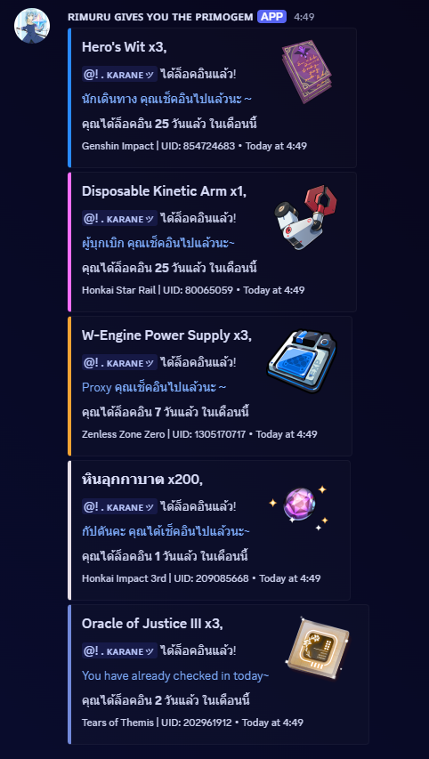

<h1 align="center">
    <br>
    Rimuru-gives-you-the-primogems
</h1>

<p align= "center">
        <a href="/README.md">English</a>   <b>Thai</b>　
    
### หรือ ***HoYoLab Auto Login***
`Javascript` นี้เป็นสคริปต์อัตโนมัติสำหรับ Google Apps Script เพื่อจัดการการเช็คอินรายวันบน HoYoLab โดยอัตโนมัติ พร้อมระบบแจ้งเตือนผลผ่าน Discord Webhook. ฟรี ใช้งานง่าย และปลอดภัยที่สุด
<p align="center"></p>

 ## คุณสมบัติ
 * **หน้าต่างการแจ้งเตือนสวย** - Embeds ที่แจ้งเตือนการล็อคอินใน Discord สวยงาม
 * **ปลอดภัย** - สามารถเอาสคริปต์ไปปรับใช้ในแบบของตัวเองได้ โดยไม่ต้องกลัวว่าข้อมูลจะรั่วไหล
 *  **ฟรี** - สามารถนำสคริปต์นี้ไปใช้งานฟรีได้ใน [Google App Script](https://script.google.com/home/start)  หรือจะใช้ในเวอร์ชั่นของ Javascript ก็ได้ 
 *  **ใช้งานง่าย** - เพราะสคริปต์ใช้ได้โดยไม่ต้องเปิดเว็บอะไรเลย และจะแจ้งเตือนอัตโนมัติผ่าน Discord Webhooks
 *  **ตั้งค่าง่าย** - ในสคริปต์จะมีโซนที่สามารถปรับแต่งเองได้ เช่น ล็อคอินเกมอะไร , UID , ภาษา , การแจ้งเตือนผ่าน Discord หรือ ปรับแต่งชื่อและรูปอวาตาร์เอง
 *  **การล็อคอิน** - ถึงจะรองรับแค่ 1 บัญชี แต่ถ้าทุกเกม login ด้วยบัญชี Hoyolab อันเดียวกัน ก็สามารถล็อคอินได้ทุกเกม **`Genshin Impact , Honkai Starrail , Zenless Zone Zero , Honkai Impact 3 , Tears of Themis`** และทุกเซิฟเวอร์ **`Asia , Europe , America , TW HK WO server`** ก็ล็อคอินได้หมด

        
## การ Setup
1. คัดลอกสคริปต์ของ `rimuru-gives-you-primogems.gs` [ภาษาอังกฤษ](gs/Rimuru-gives-you-the-primogems.js) หรือ [ภาษาไทย](gs/Thai_Rimuru-gives-you-the-primogems.js)  ที่ใช้บน Google App Script
2. ไปที่ [Google App Script](https://github.com) และสรา้งโปรเจกต์ใหม่ ตั้งชื่อตามต้องการ
3. แก้ไขในส่วน `โซนที่ต้องปรับแต่ง` จะมี Token , การตั้งค่าเกม , Uid และ การแจ้งเตือน Discord , **ดูคำแนะนำในส่วนของ Configuration ด้านล่าง**
4. เลือก `main` และกด `run` ที่บรรทัดบนสุด ยืนยันสิทธิ์การเข้าถึงให้เรียบร้อย
5. กำหนด `ตัวทริกเกอร์` เพื่อให้สคริปต์ทำงานในเวลาที่ตั้งค่าไว้ โดยไปที่ `ทริกเกอร์` รูปนาฬิกาอยู้ซ้ายสุด และกด `เพิ่มทริกเกอร์` และปรับค่า เลือกฟังก์ชั่นเป็น `runAutoCheckin` เลือกปรับใช้การทำงานเป็น `Head` เลือกแหล่งที่มาของกิจกรรมรรมเป็น `ตามเวลา` เลือกประเภทเป็น `จับเวลาเป็นวัน` และเลือกเวลาของวันเป็น `02:00 - 03:00" (หรือแล้วแต่จะตั้ง)` เลือกตั้งค่าการแจ้งเตือนเมื่อล้มเหลวเป็น `ทุกวัน`  และกด **`บันทึก`**

## Configuration
```Javascript 
     const profiles = [
    {  // --- โซนที่ต้องปรับแต่ง ---

        // --- ใส่ TOKEN ของ HoYoLab ---
        token: "ltoken_v2=xxxxxx; ltuid_v2=xxxxxx;", 

        // --- ตั้งค่าเกมที่จะเปิดใช้ออโต้ล็อคอิน ( true = เปิด , false = ปิด ) ---
        genshin: true,
        honkai_star_rail: true,
        zzz: true,
        honkai_3: true,
        Tears of Themis: true,

        // --- ใส่ UID ของเกมที่จะออโต้ล็อคอิน---
        customUids: {
            Genshin: "",
            Star_Rail: "",
            ZZZ: "",
            Honkai_3: "",
            Tears of Themis: "",
        }
     },


        // รองรับ 15 ภาษา ดังนี้
        // English: en-us
        // 简体中文 (Simplified Chinese): zh-cn
        // 繁體中文 (Traditional Chinese): zh-tw
        // 日本語 (Japanese): ja-jp
        // 한국어 (Korean): ko-kr
        // Bahasa Indonesia (Indonesian): id-id
        // Deutsch (German): de-de
        // Español (Spanish): es-es
        // Français (French): fr-fr
        // Italiano (Italian): it-it
        // Português (Portuguese): pt-pt
        // Русский язык (Russian language): ru-ru
        // ภาษาไทย (Thai language): th-th
        // Türkçe (Turkish): tr-tr
        // Tiếng Việt (Vietnamese): vi-vn

        lang: 'th-th' // <--- ใส่ภาษาที่ต้องการ ในที่นี้จะเลือกภาษาไทย
];

/** การแจ้งเตือนที่ Discord **/
const discord_notify = true; // ตั้งค่าให้เป็น true เพื่อรับการแจ้งเตือน
const myDiscordID = ""; // <---  ใส่ Discord ID ของตัวเอง
const discordWebhook = "https://canary.discord.com/api/webhooks/"; // <--- ใส่ Webhook URL
const webhooks_username = "ʀɪᴍᴜʀᴜ ɢɪᴠᴇꜱ ʏᴏᴜ ᴛʜᴇ ᴘʀɪᴍᴏɢᴇᴍ"  // <--- ใส่ชื่อของ Webhooks
const webhooks_avatar_url = "https://cdn.discordapp.com/attachments/1276433865375879199/1277718573439127572/image.png?ex=66ce2fa6&is=66ccde26&hm=0e32ea05e2b673c64ae1bfc310bd5e045875a6d5798c768c18f877929922540a&"  // <--- ใส่รูปภาพของ webhooks

/** ข้อความที่แจ้งเตือนใน Embeds*/
const logedin_text = "ได้ล็อคอินแล้ว!"
const totalclaim_text_1 = "คุณได้ล็อคอิน"
const totalclaim_text_2 = "วันแล้ว ในเดือนนี้"
```
### อธิบายค่า `config` นี้
*  **`token`** คือค่าที่คุณต้องเอามาใส่เพื่อให้สคริปต์ใช้งาน เพื่อล็อคอินบัญชีคุณได้  **```token: "ltoken_v2=xxใส่ค่าที่นี่xx; ltuid_v2=xxใส่ค่าที่นี่xx;",```** [ดูคำแนะนำเพิ่มเติม](https://github.com/Nattapat2871/Rimuru-gives-you-the-primogems/blob/main/README_TH.md#token-hoyolab)
*  **`ตั้งค่าเกมที่จะเปิดใช้ออโต้ล็อคอิน `** ตั้งค่าเกมที่เราจะล็อคอินโดยจะเปิดแค่บางเกมก็ได้ เช่น ถ้าอยากใช้แค่ Genshin ก็ให้แก้ไขสคริปต์เป็น  **```genshin: true, honkai_star_rail: false, zzz: false, honkai_3: false, Tears of Themis: false,```**
*  **`lang`** คือค่าที่ใส่เพื่อให้แสดงภาษาที่เราต้องการ ถ้าเป็นภาษาอังกฤษ แก้ไขเป็น ``` lang: 'en-us'```
*  **`CustomUid`** คือให้ใส่เลข uid ในแต่ละเกมของบัญชีนั้นลงไปโดยจะใส่หรือไม่ก็ได้
*  **`discord_notify`** คือ`เปิด`การใช้การแจ้งเตือนผ่าน Webhoook Discord ถ้า`ปิด(false)`จะไปแสดงที่ `consolelog` แทน
*  **`mydiscordID`** ใส่เพื่อระบุคนที่เป็นเจ้าของบัญชี HoYoLab และเอาไว้แท็กแจ้งเตือน
*  **`discordWebhook`** เพื่อให้สคริปต์แจ้งเตือนได้ จำเป็นต้องมี `URL` โดยไปที่เซิรฟ์เวอร์ที่เราเป็นเจ้าของ **`สร้างช่องมาใหม่ > แก้ไขช่อง > การรวม > webhooks > สร้างWebhooksใหม่ > และคัดลอก URL Webhooks`** นั้นมาใส่ในค่านี้
*  **`webhooks_username`** และ **`webhooks_avatar_url`**  เพื่อกำหนดชื่อของ Webhooks นั้นตอนแจ้งเตือน และตกแต่งด้วยภาพโปรไฟล์อวาตาร์
  
#### สคริปต์ที่ต้องแก้ไขเองมีแค่นี้ ส่วนสคริปต์ที่เหลือเป็นการเรียกใช้งานสคริปต์โดยไม่ต้องไปยุ่งกับมัน  


## Token HoYoLab  

  คือชุดข้อมูลเฉพาะที่ใช้ในการ **ยืนยันตัวตน ( Authentication )** ของคุณเมื่อต้องการเข้าถึงข้อมูลหรือบริการบางอย่างของ HoYoLab ผ่านทางโปรแกรมหรือสคริปต์ แทนที่จะเป็นการเข้าใช้งานผ่านเว็บบราวเซอร์ตามปกติ โดยทั่วไป `Token` เหล่านี้จะถูกเก็บไว้ใน `Cookies` ของเว็บบราวเซอร์หลังจากที่คุณล็อกอินเข้าสู่ระบบ [เว็บไซต์ทางการของ HoYoLab](https://hoyolab.com) คุณสามารถหาค่า `ltuid` และ `ltoken` ได้โดยการใช้

<details>
<summary><b> Chome Desktop Browser ( หาค่าในเดสก์ท็อป ) </b></summary>
<br>

1. **Go to Web** - เราสามารถดึงออกมาจากเบราเซอร์ได้โดยการเข้าไปที่ [เว็บทางการของ HoyoLab](https://www.hoyolab.com)

2. **Login** - จากนั้นทำการล็อคอินเว็บให้เรียบร้อย

3. **Developer tools** - เปิด Developer tools โดยไปที่ `รูปไอคอน 3` จุดของแอปเบราว์เซอร์มุมขวาบน > `More tools` > `Developer tools` หรือกด `F12` ก็ได้

4. **Cookies** - ไปที่หมวดของ `Application` และเลื่อนลงมาดูที่ `storage` > `cookies` > `https://hoyolab.com/home`  จากนั้นทำการค้นหา `lt` ที่ช่อง `filter`

5. **Token** - จากนั้นจะเห็น`ltoken_v2` ( กรอบสีเหลือง ) และ `ltuid_2 ` ( กรอบสีแดง ) ที่ช่องของ `NAME` เหมือนในภาพด้านล่าง

6. **Config** - ให้คัดลอก `ltoken_v2` และ `ltuid_v2` ที่แสดงในช่องของ `value` บรรทัดใดก็ได้มาอย่างละ 1 บรรทัด และนำไปใส่ในช่อง [Config](https://github.com/Nattapat2871/HoyoverseGames-auto-login/blob/main/README_TH.md#configuration)
   และวาง token ไว้ในช่อง
     `token: "ltoken_v2=xxxxxx; ltuid_v2=xxxxxx;", `
   
 <p align="center"></p>
</details>

<details>
<summary><b>Mobile Kiwi Browser Extension ( หาค่าในมือถือ ) </b></summary>
<br>
    
> **iOS** - ยังไม่มีวิธีดู `token` จากมือถือเพราะข้อจำกัดของ iOS ไม่อนุญาต และไม่มีแอปที่รองรับ `developer tools` เลย

### Andriod : 
#### เนื่องจากแอป `Chome Moblie` ไม่มี `Developer tools` ดังนั้น ต้องเปลี่ยนไปใช้ **`Kiwi browser`** และใช้ **Extension `Cookie Editor`** <br>

* **Kiwi browser** - คือเว็บเบราว์เซอร์สำหรับใช้งานบนระบบปฏิบัติการ Android พัฒนาขึ้นโดยใช้พื้นฐานจาก Chromium ซึ่งเป็นโครงการโอเพนซอร์สตัวเดียวกับที่ Google Chrome ใช้ มีจุดเด่นคือ สามารถรองรับการใช้งาน **ส่วนขยาย (Extensions)** ส่วนใหญ่ที่มีอยู่บน [Chrome Web Store](https://chromewebstore.google.com/) โดยตรงบนมือถือ Andiord  ได้
  
1. **ติดตั้ง Kiwi browser** - สามารถติดตั้ง **Kiwi browser**  ได้ใน  [play Store](https://play.google.com/store/apps/details?id=secure.unblock.unlimited.proxy.snap.hotspot.shield&pcampaignid=web_share)

2. **Extension** - เมื่อโหลดเสร็จแล้วให้เข้าไปที่แอป และไปที่ `เพิ่มเติม ( ขีด 3 ขีด )` อยู่มุมขวาบนของแอป > `Extension` > `Find&install Extension` จากนั้นค้นหาว่า [Cookie-Editor](https://addons.mozilla.org/th/firefox/addon/cookie-editor/) ตามภาพด้านล่าง และกด `Add to kiwi` > `install`

3. **Go To Web** - เมื่อติดตั้งส่วนขยายแล้วให้เข้าไปที่ [เว็บทางการของ hoyolab](https://www.hoyolab.com)  และให้ล็อคอินให้เรียบร้อย

4. **Token** - กดไปที่ `kiwi Extensions` ไอคอนสี่เหลี่ยมฝั่งซ้ายของไอคอน 3 ขีด ที่อยู่ขวาบนของแอป > `Cookie-Editor` จากนั่นจะเห็น `cookies` ทั้งหมดบนเว็บนี้ ให้เลื่อนหา `ltoken_v2` และ `ltuid_v2`

5. **Config** - ให้คัดลอก `ltoken_v2` และ `ltuid_v2` ที่แสดงในช่อง `value` และนำไปใส่ในช่อง [Config](https://github.com/Nattapat2871/HoyoverseGames-auto-login/blob/main/README_TH.md#configuration)
   และวาง token ไว้ในช่อง
     `token: "ltoken_v2=xxxxxx; ltuid_v2=xxxxxx;", `


 
<p align="center"></p>
</details>

> [!IMPORTANT]
> Token ของ HoYoLAB เปรียบเสมือนรหัสผ่านสำหรับบัญชี HoYoverse ของคุณ
> หากผู้อื่นได้ Token นี้ไป เขาจะสามารถเข้าถึงบัญชี HoYoLAB ของคุณโดยไม่ต้องรู้รหัสผ่าน , เช็คข้อมูลส่วนตัว เช่น ประวัติเช็คอิน, โปรไฟล์เกม, หรือกิจกรรมที่คุณทำใน HoYoLAB , หรืออาจจะร้ายแรงกว่านั้น
> ดังนั้น โปรดเก็บรักษา Token ให้ดีๆ อย่าให้กับบุคคลอื่นในที่สาธารณะ
> ถ้าหากคิดว่า Token ของคุณ ไม่ปลอดภัย ให้รีบเปลี่ยนรหัสผ่านบัญชี โดยไปที่ [HoYoLab Account](https://account.hoyolab.com)


## หลักการทำงาน

สคริปต์นี้จะใช้ `Token HoYoLab` ของคุณเพื่อล็อกอินเข้าสู่ระบบ HoYoLab โดยอัตโนมัติ สำหรับเกมที่คุณเลือกไว้ `(เช่น Genshin, Star Rail)` มันจะส่งคำขอเช็คอิน (API Request) ไปยังเซิร์ฟเวอร์ HoYoLab, ตรวจสอบผลลัพธ์ `(สำเร็จ, เช็คอินแล้ว, หรือติด CAPTCHA)`, และจะส่งสรุปผลการเช็คอินและของรางวัลที่ได้ ไปยัง Discord Webhook ที่คุณตั้งค่าไว้.

## Source Code 
> Source Code นี้ผมใช้ `Gemini advence 2.5 Pro` ช่วยเขียนสคริปต์ให้นิดหน่อย
* [main.js](https://github.com/Nattapat2871/Rimuru-gives-you-the-primogems/blob/main/main.js) เป็นสคริปต์ที่เอาไว้สำหรับรันในเครื่องของคุณ `เช่นรันที่ vscode` ไม่สามารถใช้ได้ที่ Google App Script แต่ฟังก์ชั่นทุกอย่างเหมือนกัน
* [node_modules](node_modules) โมดูลสำหรับ `main.js` เท่านั้น ไม่เกี่ยวกับ `Rimuru-gives-you-the-primogems.js`
* [gs](https://github.com/Nattapat2871/Rimuru-gives-you-the-primogems/tree/main/gs) ข้างในโฟล์เดอร์นี้จริงๆแล้วเป็น `.gs` **เป็นสคริปต์สำหรับรันที่ Google App Script** รันบนเครื่องไม่ได้ จะมีเวอร์ชั่น [ภาษาอังกฤษ](gs/Rimuru-gives-you-the-primogems.js) และ [ภาษาไทย](gs/Thai_Rimuru-gives-you-the-primogems.js)
* [oldscript](gs/oldscript.js) อย่าใช้สคริปต์เก่านี้ ผมใช้สคริปต์นี้ล็อคอินตลอด 1 ปีกว่า ( ผมแค่อยากเซฟสคริปต์เก่าไว้ตรงนี้ )
  <details><summary><b> old script preview</b></summary><p align=center></p></details>

## MIT License - ลิขสิทธิ์และสัญญาอนุญาต

`ลิขสิทธิ์ (c) 2025 Nattapat2871` <br>
**ให้อิสระเต็มที่:** คุณสามารถนำซอฟต์แวร์ไป ใช้, แก้ไข, แจกจ่าย, หรือแม้กระทั่งขายต่อ ได้ฟรีๆ <br>
**เงื่อนไขเดียว:** ต้อง แนบข้อความลิขสิทธิ์และตัว License นี้ ไปด้วยเสมอ <br>
**ไม่มีการรับประกัน:** ซอฟต์แวร์ให้มา "ตามสภาพ" ผู้สร้าง ไม่รับประกัน อะไรทั้งสิ้น <br>
**ไม่รับผิดชอบ:** ถ้าใช้แล้วเกิดปัญหา ผู้สร้าง ไม่รับผิดชอบ ต่อความเสียหายใดๆ

ง่ายๆ คือ "เอาไปใช้ทำอะไรก็ได้ฟรี ขอแค่ใส่ชื่อเจ้าของกับ License กำกับไว้ แต่ใช้แล้วพังหรือเกิดปัญหา ผู้สร้างไม่เกี่ยวนะ"


## Changelogs

* `17:46 25/4/2025 : เพิ่มสคริปต์เวอร์ชั่นเก่ามาในโฟล์เดอร์ gs`
* `15:23 25/4/2025 : เพิ่ม README.md ภาษาอังกฤษ`
* `10:55 25/4/2025 : เพิ่ม MIT License`
* `02:18 25/4/2025 : แก้ไข Debug ของ Consolelog นิดหน่อย`
* `23:30 24/4/2025 : เพิ่มฟังก์ชั่นเลือกภาษาได้`
* `22:46 24/4/2025 : เพิ่มฟังก์ชั่นล็อคอินเกม Tears of Themis`
* `17:59 24/4/2025 : แปลงไฟล์ Javascript (.js) เป็น Goodle App Script (.gs)` 
* `16:25 24/4/2025 : First Commit`


